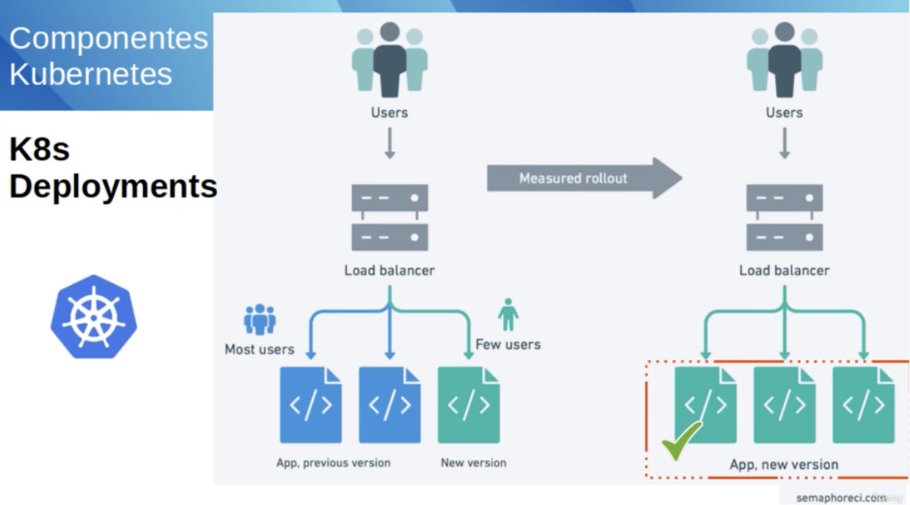

# Curso K8s

---


## Link para o curso

- [k8s](https://www.udemy.com/course/kubernetes-power-profissional-formacao-inicial-completa)

## Orchestration

### Commnads

- Adding a new replicaset

```bash
kubectl apply -f replicaset.yaml
kubectl get pods
```

- Deleting pods to see the k8s comportament

```bash
kubectl delete pod frontend-rs-45rcb
kubectl get pods
```

- Observe, k8s will repose the deleted pod with a new brand one with other hash.

- Scaling on the fly.

```bash
kubectl scale replicaset frontend-rs --replicas=10
watch kubectl get pods
```

- To get out of watch, press ctrl+c


### K8s deployments

- Implemetation
- Rolling updates
- Recreate deployment
- Roll back



- Simple nginx deployment

```yaml
---
apiVersion: apps/v1
kind: Deployment
metadata:
  name: frontend-deployment
  labels:
    app: frontend
spec:
  replicas: 4
  selector:
    matchLabels:
      env: production
  template:
    name: pod-nginx
    metadata:
      labels:
        env: production
    spec:
      containers:
      - name: pod-nginx
        image: nginx
        resources:
          limits:
            memory: "128Mi"
            cpu: "500m"
        ports:
        - containerPort: 80
```

>> Same rules apply here, you can scale on the fly any deployment.

- Checkout the deployment

```bash
kubectl rollout status deployment.apps/frontend-deployment
kubectl describe deployment.apps/frontend-deployment
```